# DoAnCaNhanAI_23110105
Báo cáo đồ án cá nhân trí tuệ nhân tạo

Đề tài: Giải bài toán đặt 8 quân xe lên bàn cờ với điều kiện chúng không ăn lẫn nhau bằng các thuật toán tìm kiếm

Giảng viên hướng dẫn: Phan Thị Huyền Trang

Sinh viên thực hiện: Nguyễn Nhật Huy_23110105
1.	Mục tiêu
-	Mục tiêu của bài toán nhằm mô phỏng cách hoạt động của các thuật toán tìm kiếm, đánh giá được hiệu suất trong tìm kiếm lời giải cho bài toán của các thuật toán tìm kiếm. Ứng dụng giao diện trực quan giúp người dùng dễ dàng hiểu được cách hoạt động của thuật toán
2.	Nội dung

    2.1.	Bài toán và lời giải
    -	Trạng thái ban đầu( state): Bàn cờ trống, 64 ô, được đánh số từ 1 đến 8 theo hàng, và theo cột
    -	Trạng thái đích: Bàn cờ được đặt 8 quân xe với điều kiện chúng không ăn nhau, trạng thái đích này do người dùng điều chỉnh
    -	Hàng động: lần lượt đặt các quân từ trái sang phải sao cho đúng với trạng thái đích mà người dùng yêu cầu
    -	Môi trường: tập hợp tất cả các trạng thái đạt được thông qua đặt từng quân xe
    -	Lời giải: lời giải bài troán là 1 ma trận mà mỗi phần tử của ma trận là vị trí của từng quân xe được đặt vào bàn cờ
 
    2.2. Các thuật toán Tìm kiếm không có thông tin (Uninformed Search)
    -	Nhóm thuật toán tìm kiếm không có thông tin bao gồm các thuật toán như: DFS( Depth-First Search)  tìm kiếm theo chiều sâu, BFS (Breadth-First Search) tìm kiếm theo chiều rộng, UCS( Uniform Cost Search) tìm kiếm với chi phí tốt nhất, DLS( Depth Limit Search) tìm kiếm chiều sâu có giới hạn, IDS( Iterative Depending Search) tìm kiếm sâu dần
    -	Chi tiết mô phỏng các thuật toán

        •	DFS( Depth-First Search): Tìm kiếm theo chiều sâu, sử dụng là ngắn xếp( stack), Duyệt sâu nhất có thể theo một nhánh trước khi quay lại.

            o	Ưu điểm: không gian bộ nhớ ít hơn đáng kể so với BFS, có thể tìm thấy lời giải nhanh nếu trạng thái địch nằm ở độ sâu nông.

            o	Nhược điểm: Có thể rơi vào lặp vô tận
        
        •	BFS (Breadth-First Search) tìm kiếm theo chiều rộng, sử dụng hàng đợi( Queue) để quản lý thứ tự mở rộng, tìm kiếm mở rộng các nút theo từng lớp

            o	Ưu điểm: luôn tìm được lời giải nếu tồn tại lời giải, tìm được lời giải ngắn nhất

            o	Nhược điểm: tốn bộ nhớ phải lưu tất các nút ở mỗi mức,  tốc độ chậm không gian tìm kiếm lớn
        

        •	UCS( Uniform Cost Search) tìm kiếm với chi phí tốt nhất, Sử dụng hàng đợi ưu tiên (Priority Queue) để chọn nút mở rộng

            o	Ưu điểm luôn tìm đường đi có tổng chi phí nhỏ nhất

            o	Nhược điểm: Tốn thời gian và bộ nhớ, đặc biệt khi có nhiều đường có chi phí thấp
        

        •	DLS( Depth Limit Search) tìm kiếm chiều sâu có giới hạn, Nếu không tìm được lời giải trong độ sâu này → dừng.

            o	Ưu điểm: Tránh vòng lặp vô hạn của DFS, ghiảm bớt không gian tìm kiếm nếu trạng thái đích nằm trong độ sâu của limit

            o	Nhược điểm: Không hoàn chỉnh nếu giới hạn độ sâu < độ sâu thật của lời giải, cần chọn giới hạn  phù hợp vì khó xác định trước.
        

        •	IDS( Iterative Depending Search) tìm kiếm sâu dần, chạy DLS nhiều lần với giới hạn tăng dần: limit = {0, 1, 2, 3, ……}

            o	Ưu điểm Tiết kiệm bộ nhớ như DFS

            o	Nhược điểm: Tốn thời gian do phải lặp lại các cấp độ trước
        

    -	Biểu đồ so sánh hiệu suất:

        •	Biểu đồ theo thời gian thực thi của từng thuật toán
        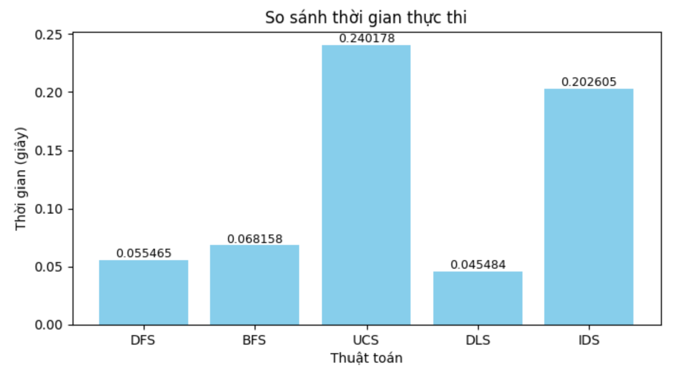
        
        •	Biểu đồ theo số bước thực thi của các thuật toán
        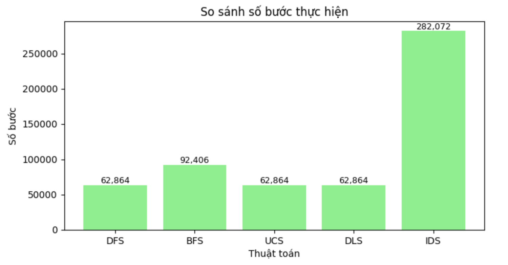

         
        •	Biểu đồ so sánh các thuật toán theo công thức 1/(Step x Time)
        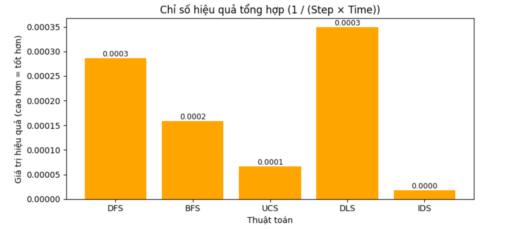
 

    2.3.	Các thuật toán Tìm kiếm có thông tin (Informed Search)
    -	Nhóm các thuật toán hoạt động tương tự với cá thuật toán tìm kiếm không có thông tin nhưng các thuật toán này sử dụng thêm cá hàm heuristic để ước lượng, tính toán trạng thái hiện tại với trạng thái đích. Các thuật toán trong nhóm này bao gồm Greedy, A*
    -	Chi tiết mô phỏng các thuật toán

        •	Greedy: mở rộng các trạng thái dựa trên giá trị heuristic tốt nhất

            o	Ưu điểm: tìm được lời giải nhanh chóng

            o	Nhược điểm: hiệu suất thuật toán phụ thuộc nhiều vào các hàm tính toán chi phí
        
        •	A*: Mở rộng các trạng thái tiếp theo dựa trên tổng chi phí từ trạng thái ban đầu tới trạng thái hiện tại và chi phí từ trạng thái hiện tại tới trạng thái mục tiêu

            o	Ưu điểm: đảm bảo đầy đủ và tính tối ưu

            o	Nhược điểm: gặp khó khăn trong việc xây dựng hàm tính toán sao cho phù hợp với yêu cầu bài toán
        
    -	Biểu đồ so sánh hiệu suất:

        •	Biểu đồ theo thời gian thực thi của từng thuật toán
        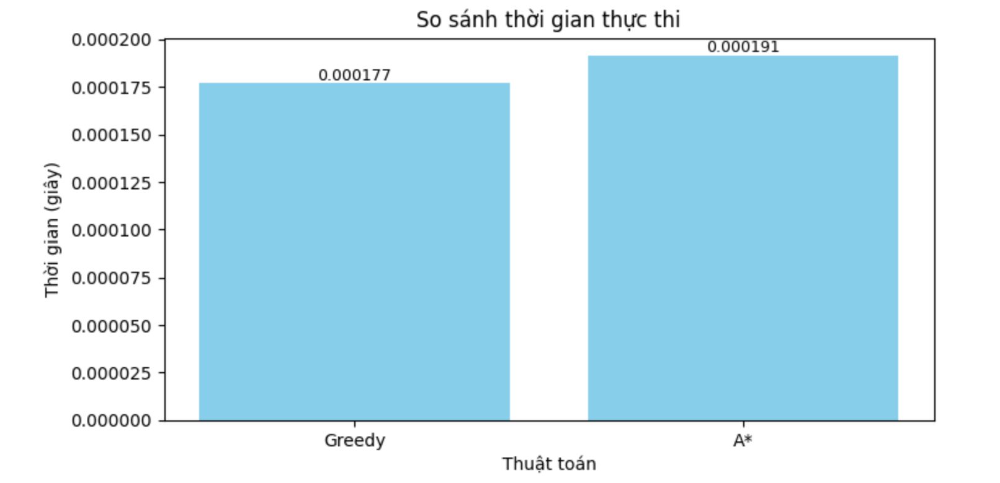
            
        •	Biểu đồ theo số bước thực thi của các thuật toán
        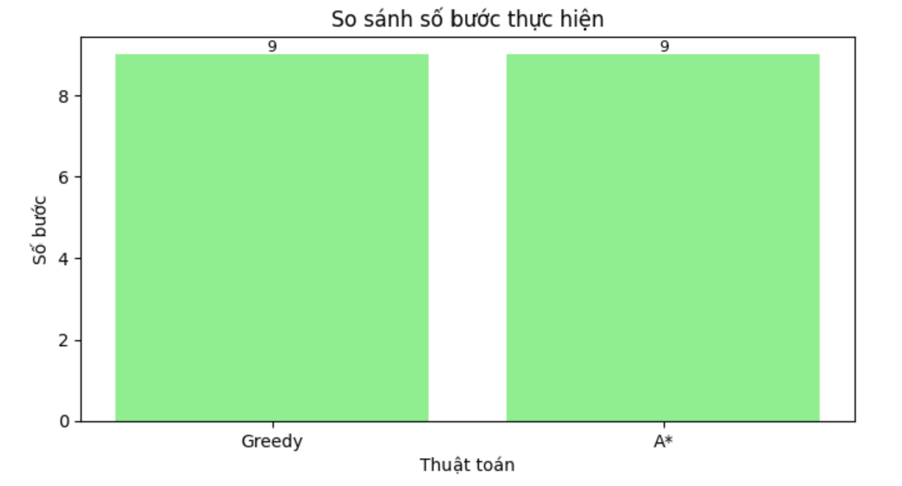

             
        •	Biểu đồ so sánh các thuật toán theo công thức 1/(Step x Time)
            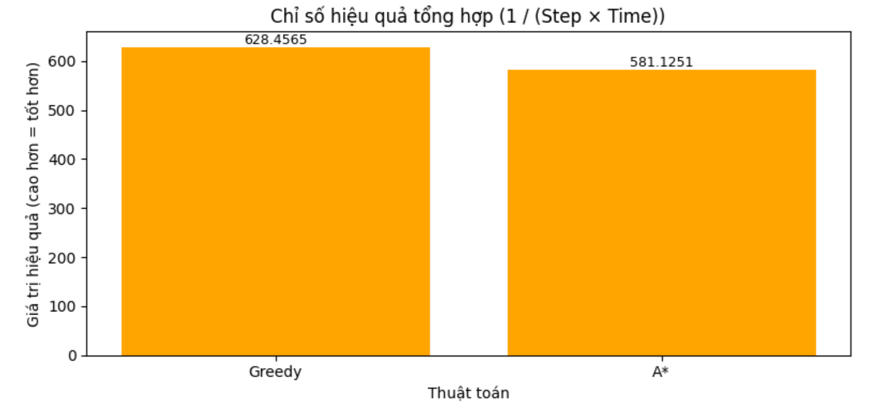

    2.4. Các thuật toán Tìm kiếm cục bộ( Local Search)
    -	Nhóm các thuật toán tìm kiếm cục bộ là hoạt động tìm kiếm trên một không gian trạng thái duy nhất, chỉ di chuyển từ trạng thái hiện tại sang trạng thái tiếp theo theo một tiêu chi mà từng thuật toán yêu cầu, chỉ khi trạng thái tiếp theo đáp ứng được yêu cầu của từng thuật toán thì mới chuyển sang trạng thái đó để tìm kiếm. Các thuật toán bao gồm: Hill Climbing, Genetic Algorithm, Simulated Annealing và Beam Search
    -	Chi tiết mô phỏng các thuật toán

    •	Hill Climbing: thuật toán leo đồi, di chuyển đến trạng thái lân cận tốt nhất trong tất cả các trạng thái lân cận của nó

        o	Ưu điểm: tiết kiệm rất nhiều về bộ nhớ, đơn giản dễ triển khai

        o	Nhược điểm: dễ bị mắc kệt ở cực trị địa phương khi thuật toán không tìm thấy các trạng thái lân cận nào tốt hơn chính nó
    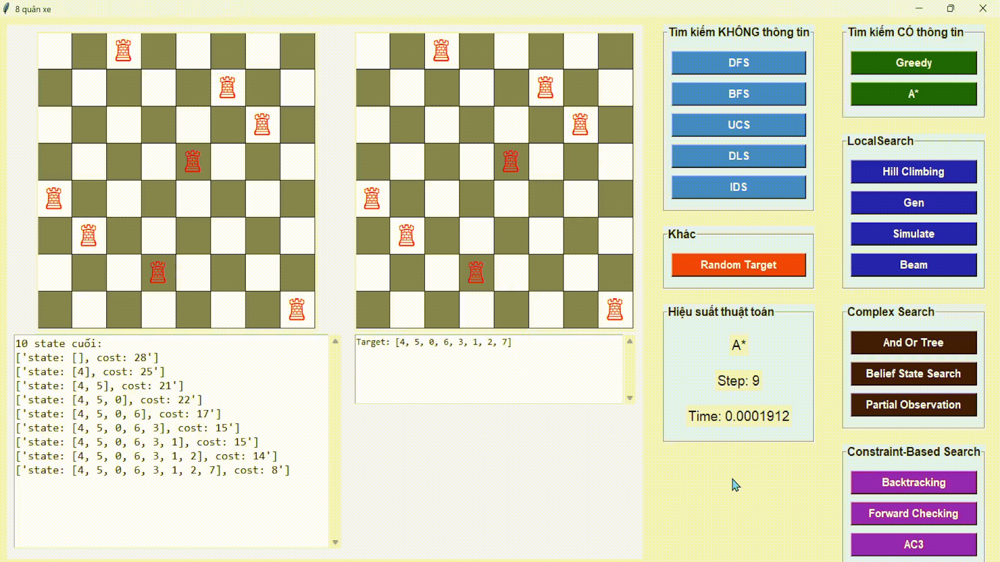
    •	Genetic Algorithm: thuật toán lai ghép, sử dụng các nguyên tắc tiến hóa như chọn lọc, lai ghép, đột biến các cá thể( ở đây là các trạng thái được sinh ra), việc lựa chọn cá thể được thông qua đánh giá thích nghi của cá thể đó trong môi trường

        o	Ưu điểm: tìm kiếm được trong không gian lớn, phù hợp cho các bài toán phức tạp

        o	Nhược điểm: gặp khó khăn trong việc thiết kế thuật toán đánh giá được sự thích nghi, lai ghép và đột biến sao cho hiệu quả để tạo ra được các cá thể tốt nhất
    
    •	Simulated Annealing: thuật toán dựa theo ý tưởng của lò luyện kim nhiệt độ giảm dần, thuật toán cho phép di chuyển đến các trạng thái lân cận và chấp nhận trạng thái có độ đánh giá xấu hơn nó theo xác suất

        o	Ưu điểm: tối ưu hơn thuật toán Hill Climbing vì thoát khỏi được cực trị địa phương

        o	Nhược điểm: khó khăn trong việc xây dựng hàm xác suất sao cho đúng với yêu cầu bài toán cũng như việc giảm nhiệt độ sao cho phù hợp 
    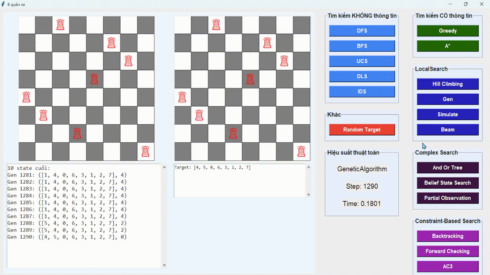

    •	Beam Search: thuật toán tương tự như BFS nhưng thay vì sử dụng hết tất cả các nút trong cùng một tầng thì thuật toán này chỉ sử dụng K trạng thái tốt nhất được sinh ra để đưa vào hàm đợi 

        o	Ưu điểm: giảm mạnh không gian bộ nhớ

        o	Nhược điểm: có thể bỏ qua kết quả, hoặc khó trong việc xây dựng hàm đánh giá trạng thái
    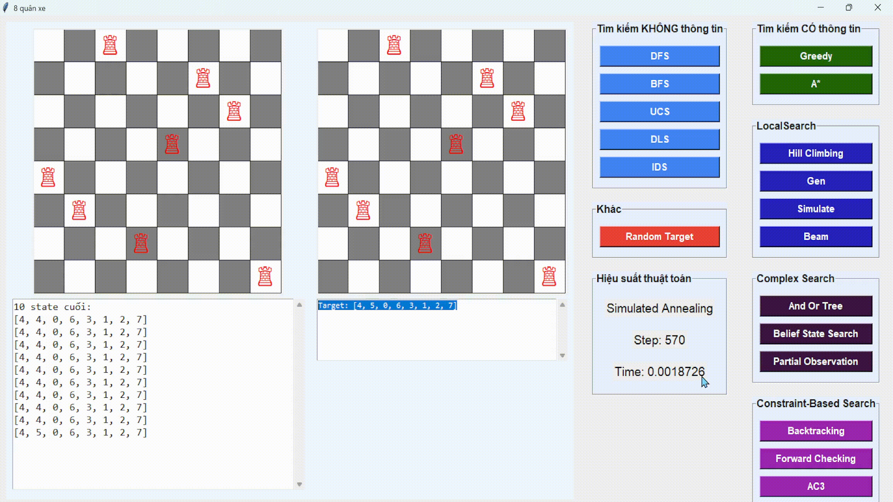

    -	Biểu đồ so sánh hiệu suất:
        •	Biểu đồ theo thời gian thực thi của từng thuật toán
        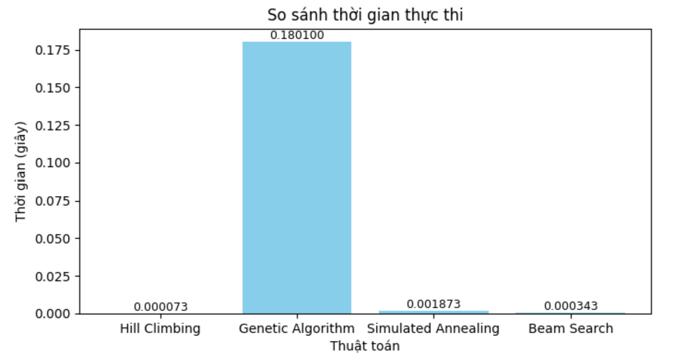
        •	Biểu đồ theo số bước thực thi của các thuật toán
        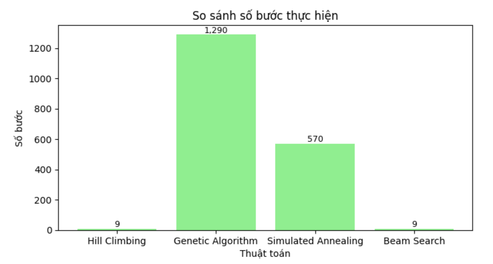
        •	Biểu đồ so sánh các thuật toán theo công thức 1/(Step x Time)
        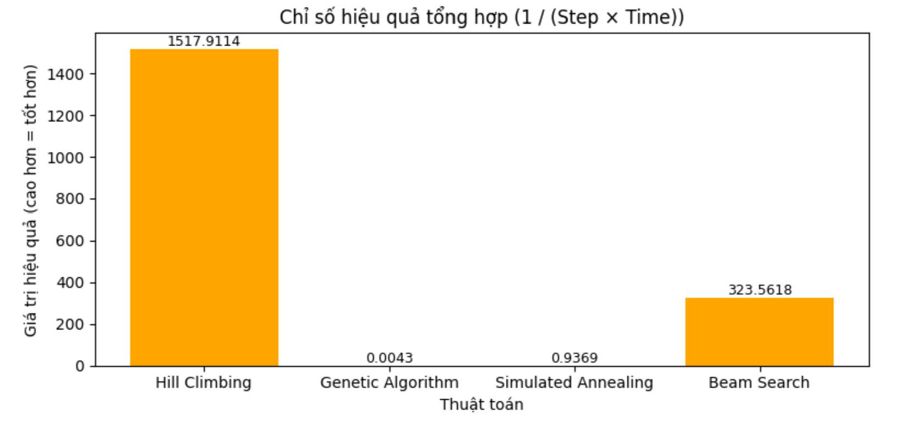
    2.5. Các thuật toán Tìm kiếm phức tạp( Complex Search)
    -	Nhóm thuật toán bao gồm các thuật toán tìm kiếm lời giải trong môi trường phức tạp, không chắc chắn hoặc có quan sát được một phần môi trường
    -	Chi tiết mô phỏng các thuật toán
        •	 AND-OR Search: sử dụng cho các bài toán có yếu tố lựa chọn( OR nodes) và yếu tố bắt buộc( And node)

            o	Ưu điểm: Mô hình hóa được môi trường không chắc chắn
            
            o	Nhược điểm: Không phù hợp cho không gian lớn
        

        •	Belief State Search: tìm kiếm lời giải trong môi trường không quan sát được, trạng thái có được chỉ là “trạng thái niềm tin” 

            o	Ưu điểm: Xử lý được sự không chắc chắn trong tri thức ban đầu

            o Nhược điểm: dễ bị mắc kệt ở cực trị địa phương khi thuật toán, Giữ được toàn bộ khả năng có thể xảy ra 
        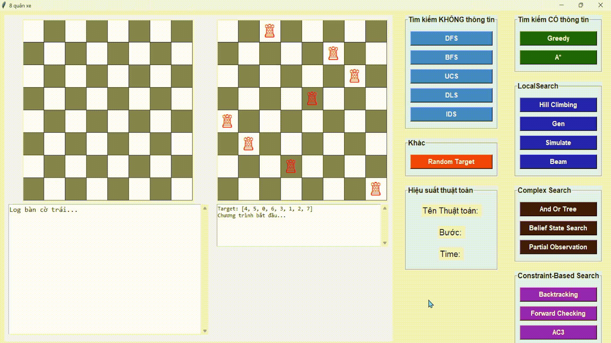
        •	Search with Partial Observation: tìm kiếm lời giải chỉ quan sát được một phần trạng thái của môi trường

            o	Ưu điểm: Kết hợp tìm kiếm với suy luận (inference)

            o	Nhược điểm: Không xác định được trạng thái thật, Dễ rơi vào lặp hoặc sai hướng
        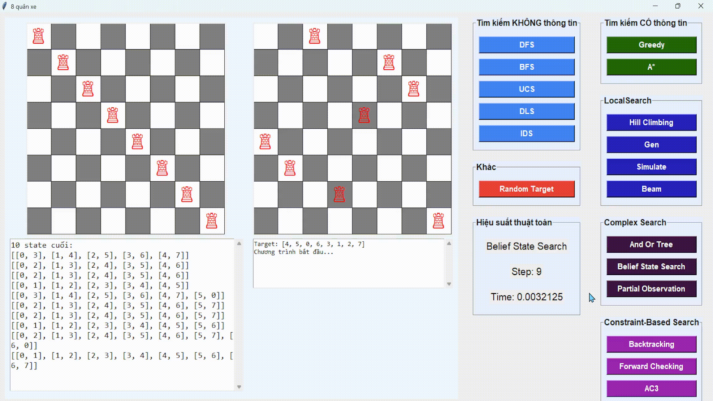

    -	Biểu đồ so sánh hiệu suất:

        •	Biểu đồ theo thời gian thực thi của từng thuật toán
        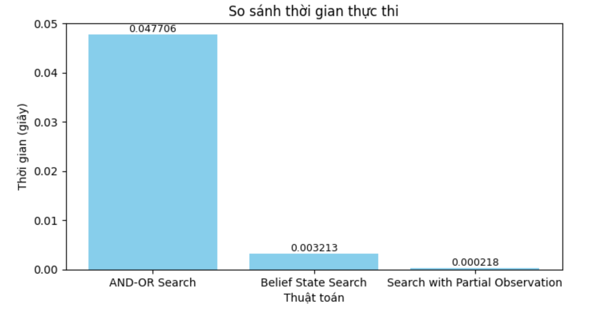
        •	Biểu đồ theo số bước thực thi của các thuật toán
        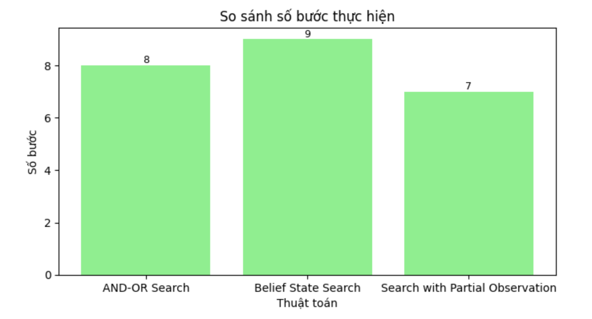
        •	Biểu đồ so sánh các thuật toán theo công thức 1/(Step x Time)
        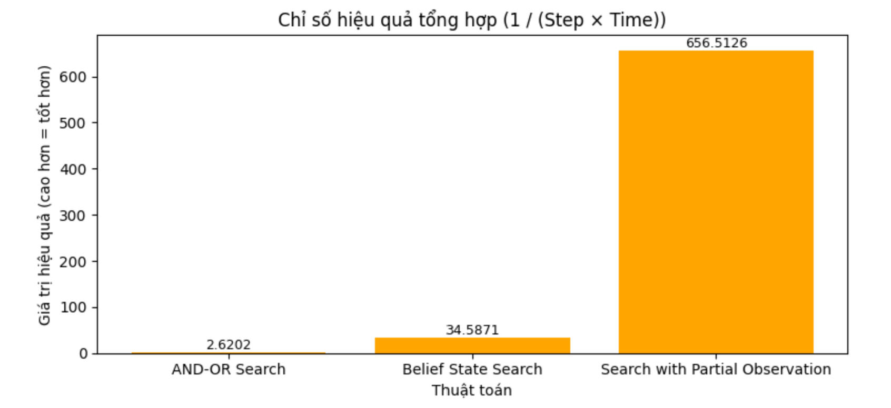

    2.6. Các thuật thuật toán Tìm kiếm dựa trên ràng buộc (Constraint-Based Search)
    -	Là nhóm các thuật toán tìm kiếm lời giải thỏa các ràng buộc mà bài toán yêu cầu ví dụ ở bài toán đặt quân xe thì điều kiện ràng buộc là không được phép 2 quân xe nào nằm trên dùng một hàng hay cùng một cột. Các thuật toán bao gồm Backtracking Search, Forward Checking, Constraint Propagation (AC3)

    -	Chi tiết mô phỏng các thuật toán
        •	 Backtracking Search: Là phương pháp tìm kiếm theo chiều sâu (DFS) trong không gian nghiệm

            o	Ưu điểm: Đơn giản, dễ cài đặt, tiết kiệm bộ nhớ
            
            o	Nhược điểm: Tốc độ chậm, không tận dụng được thông tin ràng buộc sớm
        
        •	Forward Checking: là phiên bản cải tiến của Backtracking Search, sau mỗi lần gán giá trị cho một biến thì loại bỏ trước những những giá trị không hợp lệ

            o	Ưu điểm: Phát hiện mâu thuẫn sớm từ đó giảm đáng kể số lần backtrack

            o	Nhược điểm: Tốn bộ nhớ hơn backtracking
        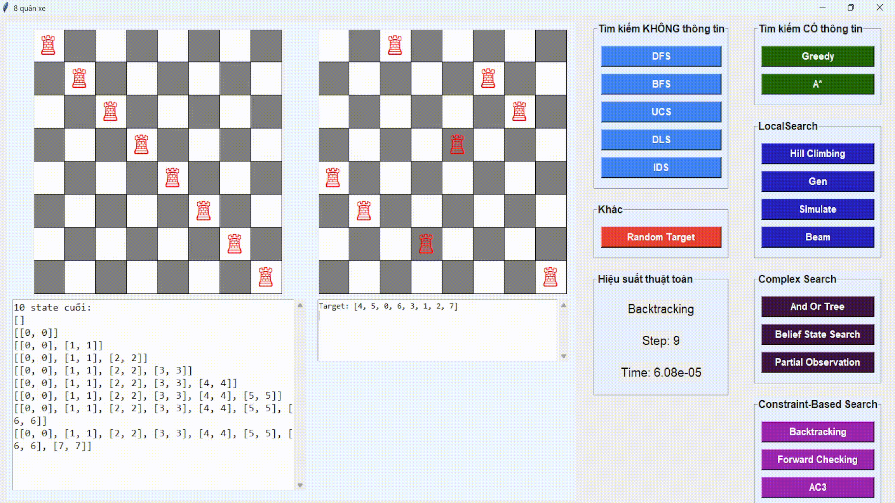

        •	Constraint Propagation (AC3): Thuật toán AC-3 sẽ lặp lại việc loại bỏ các giá trị không hợp lệ khỏi domain cho đến khi toàn bộ các cung nhất quán

            o	Ưu điểm: Loại bỏ được nhiều giá trị sai trước khi tìm kiếm, không cần quay lui nhiều

            o	Nhược điểm: Tốn bộ nhớ hơn Backtracking và Forward Checking, không loại bỏ được mọi mâu thuẫn phức tạp
        
        
    -	Biểu đồ so sánh hiệu suất:
        •	Biểu đồ theo thời gian thực thi của từng thuật toán
        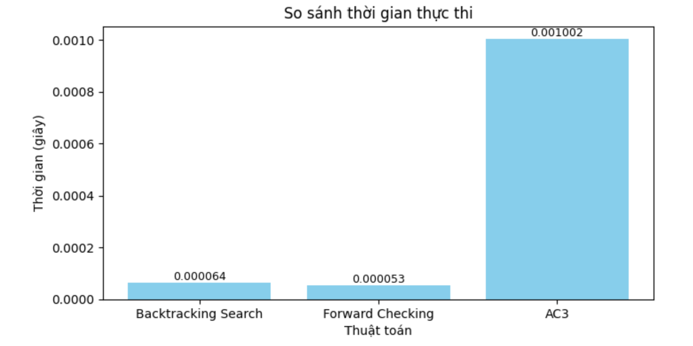

        •	Biểu đồ theo số bước thực thi của các thuật toán
        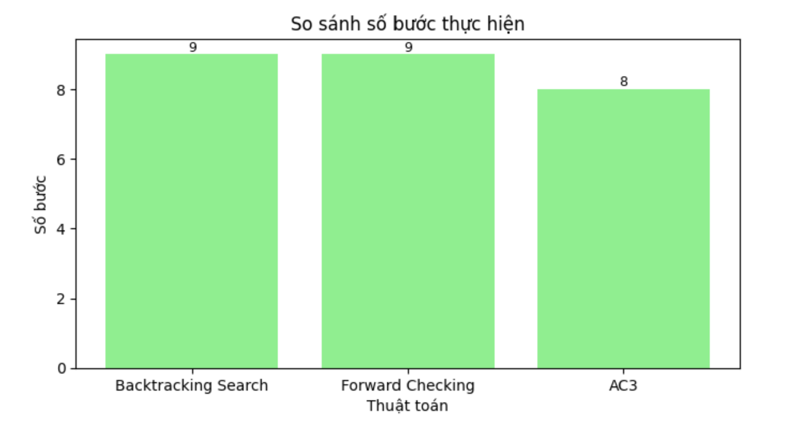

        •	Biểu đồ so sánh các thuật toán theo công thức 1/(Step x Time)
        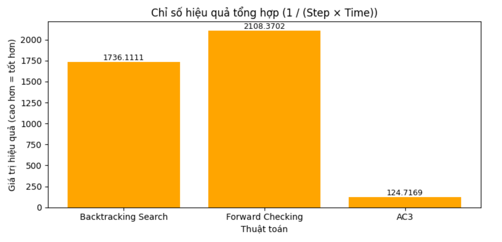
 

